## Exercise 1: Azure data, storage, and serverless environment setup

**Duration**: 30 minutes

You must provision a few resources in Azure before you start developing the solution. Ensure all resources use the same resource group for easier cleanup.

In this exercise, you will provision a blob storage account using the Hot tier, and create two containers within to store uploaded photos and exported CSV files. You will then provision two Function Apps instances, one you will deploy from Visual Studio, and the other you will manage using the Azure portal. Next, you will create a new Event Grid topic. After that, you will create an Azure Cosmos DB account with two collections. Finally, you will provision a new Cognitive Services Computer Vision API service for applying object character recognition (OCR) on the license plates.                                   |

### Task 1: Provision the storage account

1. Using a new tab or instance of your browser, navigate to the Azure portal ```http://portal.azure.com```.

2. In the Azure portal's left navigation, select **+ Create a resource**, then search for and select **Storage account**, followed by **Create**.

    

   

3. On the **Create storage account** blade, specify the following configuration options:

    -  For **Resource group**, select the **Use existing** radio button, and select the **serverless-architecture-DID** resource group.

    -  **Name**: Enter a unique value for the storage account name, include **DeploymentID/DID** as suffix in storage account name to make it unique, such as **tollboothstorageDID** where DID is unique ID present in your Azure username. For example: Username - <inject key="AzureAdUserEmail"></inject>, here six digit number is the **DeploymentID**. 
    
          **Note:** All characters of the Name must be in lower case; ensure the green check mark appears.

    -  Ensure the **Location** selected is the same region as the resource group.

    -  For performance, ensure **Standard** is selected.

    -  For account kind, select **StorageV2 (general purpose v2)**.

    -  For replication, select **Locally-redundant storage (LRS)**.

   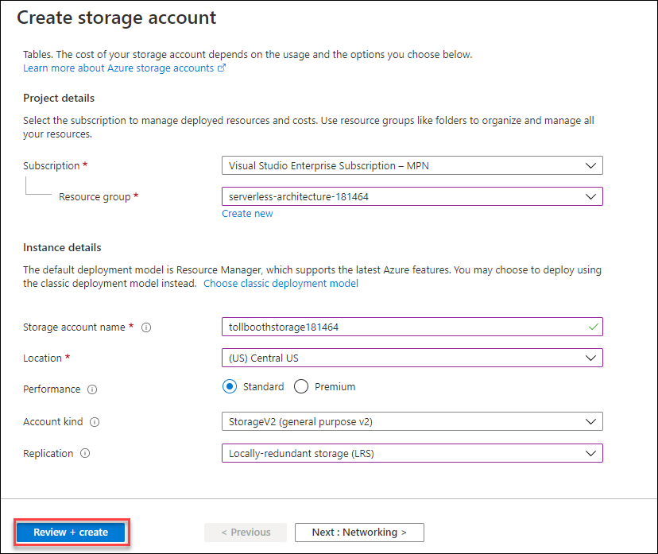

4. Select **Review + create**, then select **Create**.

5. After the storage account has completed provisioning, open the storage account by selecting **Go to resource**.

   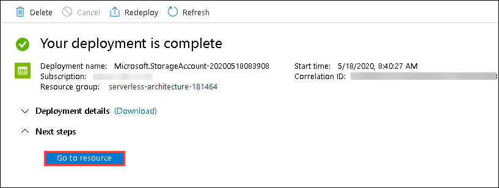

6. On the **Storage account** blade, select **Access Keys**, under Settings in the menu. Then on the **Access keys** blade, click on **Show Keys** then select the **Click to copy** button for **key1 connection string.**

   

7. Paste the value into a text editor, such as Notepad, for later reference.

8. Select **Containers** under **Blob Service** in the menu. Then select the **+ Container** button to add a new container. 

   
   
   In the **Name** field, enter **images**, select **Private (no anonymous access)** for the public access level, then select **Create** to create a container.

   

9. Repeat these steps to create a container named **export**.

    

### Task 2: Provision the Function Apps

1. Navigate to the Azure portal, <http://portal.azure.com>.

2. Select **+ Create a resource**, then enter **function** into the search box on top. Select **Function App** from the results.

    

3. Select the **Create** button on the **Function App overview** blade.

   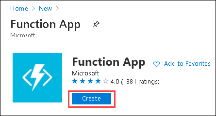

4. Within the **Create Function App** *Basics* blade, specify the following configuration options:

    a. **Subscription**: Select your Azure subscription for this lab.

    b. **Resource Group**: Select **serverless-architecture-DID**.

    c. **Name**: Provide name as to **TollBoothFunctionApp-DID** , you can find DID from **Environment Details** page.

    d. **Publish**: Select **Code**.

    e. **Runtime stack**: Select **.NET Core**.
    
    f. **Version**: Select **3.1**

    g. **Region**: Select the region you are using for this lab, or the closest available one.

   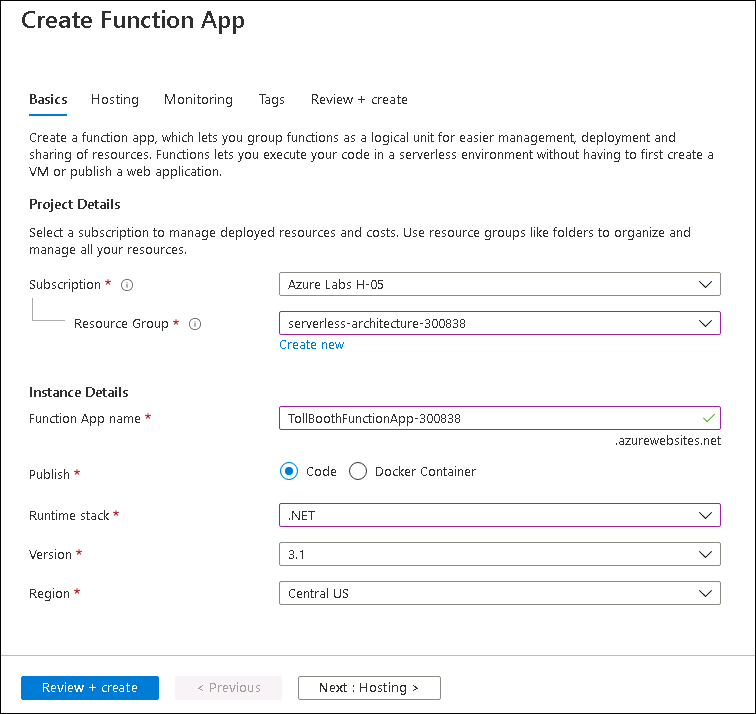
   
5. Select **Next: Hosting >**.

6. Within the **Hosting** blade, specify the following configuration options:

    a. **Storage account**: Click on **create new** and enter name as **storageaccountappDID**.
    
     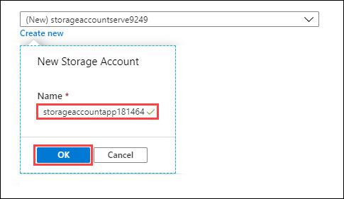

    b. **Operating system**: Select **Windows**.

    c. **Plan type**: Select **Consumption**.

   

7. Select **Next: Monitoring >**.

    a. **Enable Application Insights**: Select **Yes**.

    b. **Application Insights**: Select **Create new**.

    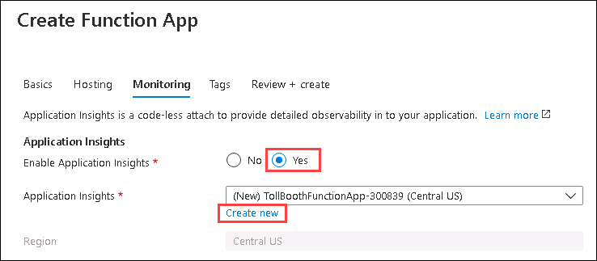

> **Note:** If **Yes** option is disabled for you, follow the steps given below:
>
> 1. Go back to **Hosting** tab and switch the Operating systems by selecting Linux and then selecting **Windows** again.
>
> This will refresh the settings in the **Monitoring** tab.
>
> 2. Select **Next: Monitoring** and here the **Yes** will be enabled now.

8. In the `Create new Application Insights` dialog, provide the following information:

    a. **Name**: Unique value for the App name similar to **TollboothMonitor-DID** (ensure the green check mark appears).
    
    b. **Location**: Select the same Azure region you selected for your Function App.
    
    c. **Workspace**: Click on Create new, provide name as **workspace-DID** and click on **OK**.
    
      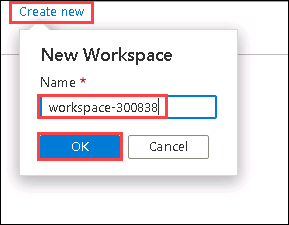
  
   Select **OK** on the `Create new Application Insights` dialog.
     
     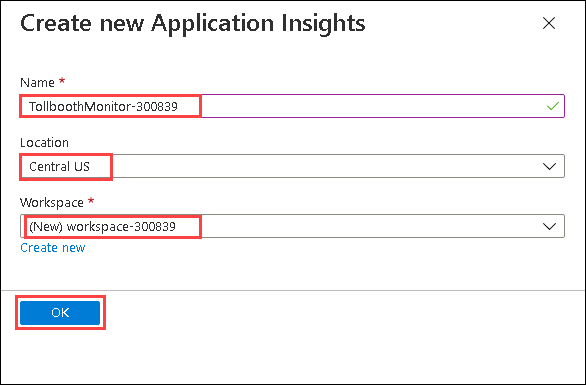
  
9. Select **Review + create**, then select **Create** to provision the new Function App.

   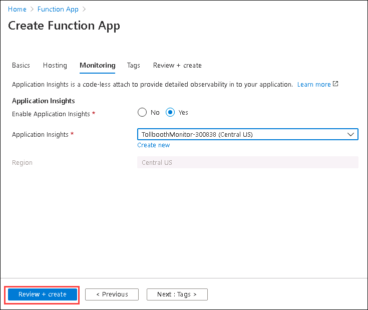

10. **Repeat steps 1-3** to create a second Function App.

11. Within the **Create Function App** blade *Basics* tab, specify the following configuration options:

    a. **Subscription**: Select your Azure subscription for this lab.

    b. **Resource Group**: Select **serverless-architecture-DID**.

    c. **Name**: Unique value for the App name (ensure the green check mark appears). Provide a name similar to **TollBoothEvents-DID**.

    d. **Publish**: Select **Code**.

    e. **Runtime stack**: Select **Node.js**.

    f. **Version**: Select **12 LTS**
    
    8. **Region**: Select the region you are using for this lab, or the closest available one.

   

12. Select **Next: Hosting >**.

13. Within the **Hosting** blade, specify the following configuration options:

    a. **Storage account**:  Click on **create new** and enter name as **storageaccounteveDID**.
    
    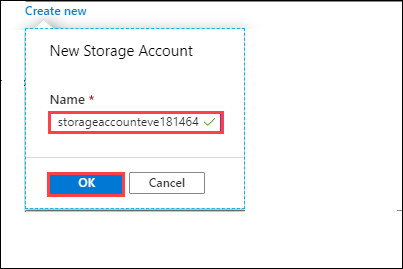

    b. **Operating system**: Select **Windows**.

    c. **Plan type**: Select **Consumption**.

    

14. Select **Next: Monitoring >**.

    a. **Enable Application Insights**: Select **Yes**.

    b. **Application Insights**: Select the Application Insights instance you created earlier when provisioning the .NET Function App (ex. **TollboothMonitor**).

   

15. Select **Review + create**, then select **Create** to provision the new Function App.

### Task 3: Provision the Event Grid topic

1. Navigate to the Azure portal, <http://portal.azure.com>.

2. Select **+ Create a resource**, then enter **event grid** into the search box on top. Select **Event Grid Topic** from the results.

    

3. Select the **Create** button on the **Event Grid Topic overview** blade.

    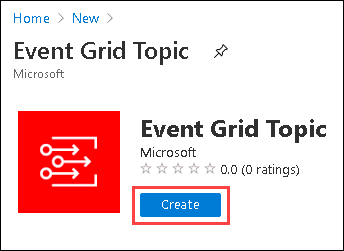

4. On the **Create Topic** blade, specify the following configuration options:

    a. **Name:** Unique value for the App name such as **TollboothEventGrid-DID** (ensure the green check mark appears).

    b. Select the Resource Group **serverless-architecture-DID**.

    c. Ensure the **Location** selected is set to the same region as your Resource Group.
    
   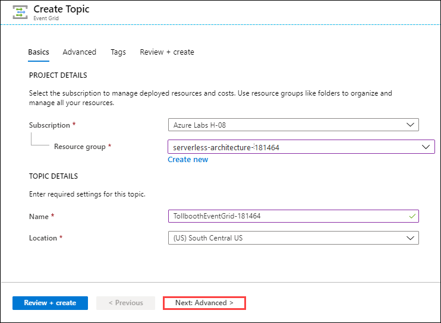

    d. Click on **Next:Advanced**. Select the event schema as **Event Grid Schema** and then click **Review + create**.

     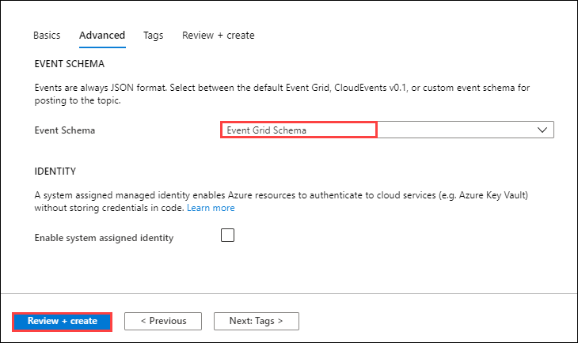

5. Now select **Create**.

6. After the Event Grid topic has completed provisioning, open the account by opening the **serverless-architecture-DID** resource group, and then selecting the **Event Grid** topic name.

7. Select **Overview** in the menu, and then copy the **Topic Endpoint** value.

   

8. Select **Access Keys** under Settings in the menu.

9. Within the **Access Keys** blade, copy the **Key 1** value.

   

10. Paste the values into a text editor, such as Notepad, for later reference.

### Task 4: Provision the Azure Cosmos DB account

1. Navigate to the Azure portal, ```http://portal.azure.com```.

2. Select **+ Create a resource**, select **Databases** then select **Azure Cosmos DB**.

    

3. On the **Create new Azure Cosmos DB** **account** blade, specify the following configuration options:

    a. Specify the Resource Group **serverless-architecture-DID**.

    b. For Account Name, type a unique value for the App name such as **tollboothdb-DID** (ensure the green check mark appears).

    c. Select the **Core (SQL)** API.

    d. Select the same **Location** as your Resource Group if available. Otherwise, select the next closest **region**.

    e. Ensure **Notebooks** is disabled.

    f. Ensure **Apply Free Tier Discount** is disabled.

    g. Select **Production** for the **Account Type**.

    h. Ensure **Geo-Redundancy** is disabled.

    i. Ensure **Multi-region writes** is disabled.

    j. Ensure **Availability Zones** is disabled.

Leave other configurations set on default.

   

4. Select **Review + create**, then select **Create**.

5. After the Azure Cosmos DB account has completed provisioning, open the account by opening the **serverless-architecture-DID** resource group, and then selecting the **Azure Cosmos DB** account name.

6. Select **Data Explorer** in the left-hand menu, then select **New Container**.

   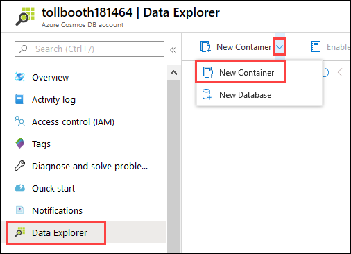

7. On the **Add Container** blade, specify the following configuration options:

    a. Enter **LicensePlates** for the **Database id**.

    b. Leave **Provision database throughput** unchecked.

    c. Enter **Processed** for the **Container id**.

    d. Partition key: **/licensePlateText**

    e. Throughput: **5000**

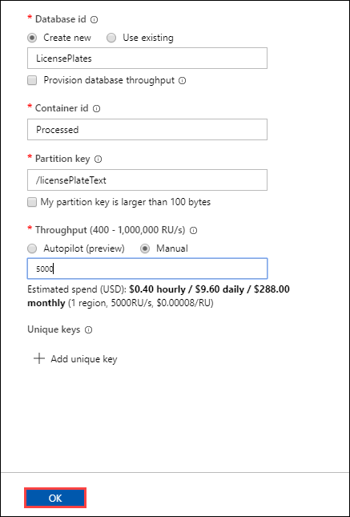

8. Select **OK**.

9. Select **New Container** to add another container.

10. On the **Add Container** blade, specify the following configuration options:

    a. For Database id, choose **Use existing** and select **LicensePlates**.

    b. Enter **NeedsManualReview** for the **Container id**.

    c. Partition key: **/fileName**
    
    d. Throughput: **5000**

   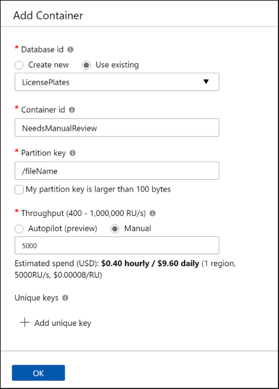

11. Select **OK**.

12. Select **Firewall and virtual networks** in the left-hand menu, under **Allow access from** select **Selected networks**.

13. Select **+ Add my current IP** to add your IP address to the IP list under Firewall. Next, check the box next to **Accept connections from within public Azure datacenters**. This will enable Azure services, such as your Function Apps to access your Azure Cosmos DB account and select **Save**.

    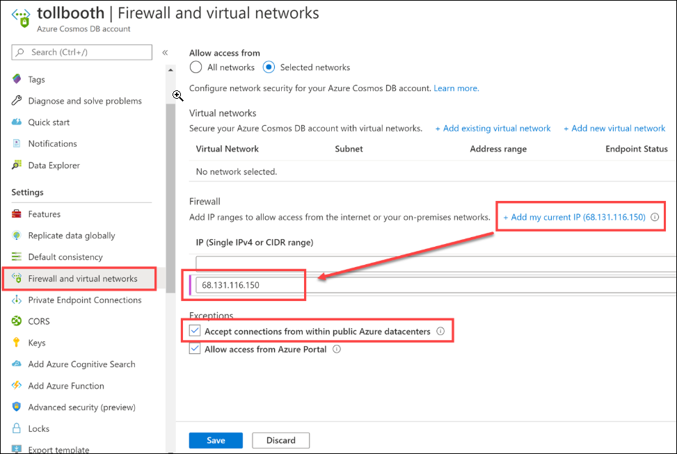

14. Select **Keys** under Settings in the menu.

15. Underneath the **Read-write Keys** tab within the Keys blade, copy the **URI** and **Primary Key** values.

   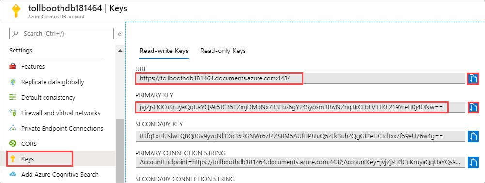

16. Paste the values into a text editor, such as Notepad, for later reference.

### Task 5: Provision the Computer Vision API service

1. Navigate to the Azure portal,```http://portal.azure.com```.

2. Select **+ Create a resource**, then enter **computer vision** into the search box on top. Select **Computer Vision** from the results.

    

3. Select the **Create** button on the **Computer Vision API** **Overview** blade.

   
  
4. On the **Create Computer Vision API** blade, specify the following configuration options:

    a. **Name**: Unique value for the App name such as **tollboothvision-DID** (ensure the green check mark appears).

    b. Ensure the **Location** selected is the same region as your Resource Group.

    c. For pricing tier, select **S1 (10 Calls per second)**.

    d. Specify the Resource Group **serverless-architecture-DID**.
    
    e. Select **Review + create**, then **Create**.

   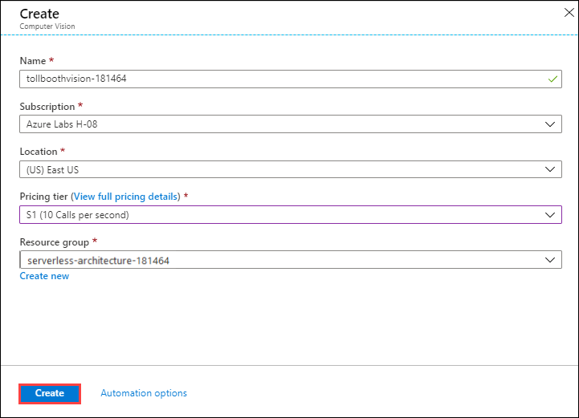

5. After the Computer Vision API has completed provisioning, open the service by opening the **serverless-architecture-DID** resource group, and then selecting the **Computer Vision** **API** service name.

6. Under Resource Management in the left-hand menu, select **Keys and Endpoint**.

7. Within the **Keys and Endpoint** blade, click on **Show Keys** and copy the **KEY 1** value and **ENDPOINT** value.

   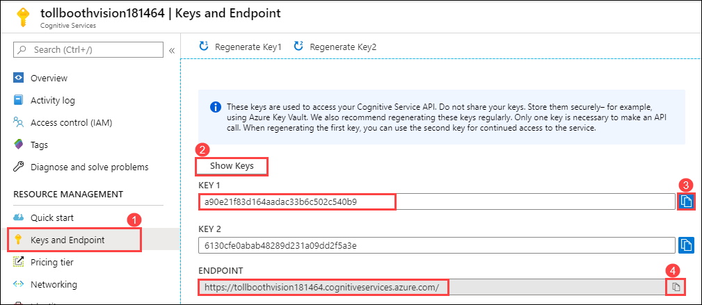
   
8. Paste the values into a text editor, such as Notepad, for later reference.

### Task 6: Provision Azure Key Vault

Azure Key Vault is used to securely store all secrets, such as database connection strings and keys.

1. Navigate to the Azure portal, ```http://portal.azure.com```.

2. Select **+ Create a resource**, then enter **key vault** into the search box on top. Select **Key Vault** from the results.

    

3. Select the **Create** button on the **Key Vault** **overview** blade.

   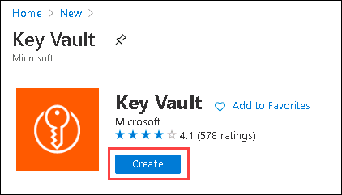
   
4. On the **Create key vault** blade, specify the following configuration options:

    a. **Subscription**: Select your Azure subscription used for this lab.

    b. **Resource group**: Select **serverless-architecture-DID**.

    c. **Key vault name**: Unique value for the name such as **TollBoothVault-DID** (ensure the green check mark appears).

    d. **Region**: Select the same region as your Resource Group.

    e. **Pricing tier**: Select **Standard**.
    
    f. **Days to retain deleted vaults**: Leave at 90.

    g. **Purge protection**: Select Disable.

   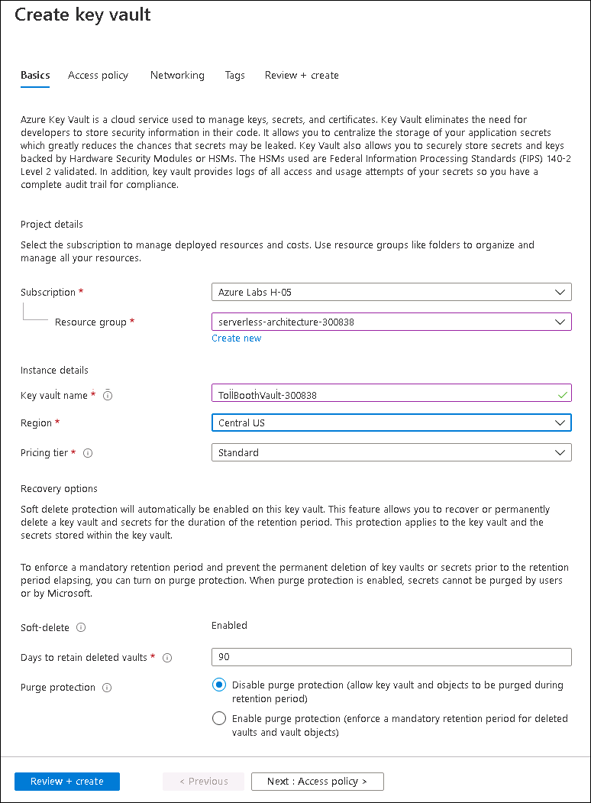
   
5. Select **Review + create**, then select **Create**.

6. After the deployment completes, select **Go to resource**.

   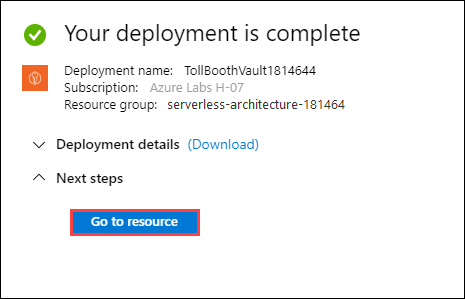

7. Select **Secrets** under Settings in the left-hand menu.

8. Select **Generate/Import** to add a new key.

   

9. Use the table below for the Name / Value pairs to use when creating the secrets. You only need to populate the **Name** and **Value** fields for each secret, and can leave the other fields at their default values.

    |                          |                                                                                                                                                             |
    | ------------------------ | :---------------------------------------------------------------------------------------------------------------------------------------------------------: |
    | **Name**      |                                                                          **Value**                                                                          |
    | computerVisionApiKey     |                                                               Paste the value of **Computer Vision API key** which you noted earlier                                                               |
    | eventGridTopicKey        |                                                               Paste the value of **Event Grid Topic access key** which you noted earlier                                                            |
    | cosmosDBAuthorizationKey |                                                               Paste the value of **Cosmos DB Primary Key** which you noted earlier                                                               |
    | blobStorageConnection    |                                                               Paste the value of **Blob storage connection string** which you noted earlier                                                               |

    When you are finished creating the secrets, your list should look similar to the following:

    

### Task 7: Retrieve the URI for each secret

When you set the App Settings for the Function App in the next section below, you will need to reference the URI of a secret in Key Vault, including the version number. To do this, perform the following steps for each secret and **copy the values** to Notepad or similar text application.

1. Open your Key Vault instance in the portal.

2. Select **Secrets** under Settings in the left-hand menu.

3. Select the secret whose URI value you wish to obtain.

4. Select the **Current Version** of the secret.

    

5. Copy the **Secret Identifier**.

    

    When you add the Key Vault reference to this secret within a Function App's App Settings, you will use the following format: `@Microsoft.KeyVault(SecretUri={referenceString})`, where `{referenceString}` is replaced by the Secret Identifier (URI) value above. **Be sure to remove the curly braces (`{}`)**.

    For example, a complete reference would look like the following:

    `@Microsoft.KeyVault(SecretUri=https://tollboothvault.vault.azure.net/secrets/blobStorageConnection/d6ea0e39236348539dc33565e031afc3)`

When you are done creating the values, you should have a list similar to the following:

```text
@Microsoft.KeyVault(SecretUri=https://tollboothvault.vault.azure.net/secrets/blobStorageConnection/771aa40adac64af0b2aefbd741bd46ef)
@Microsoft.KeyVault(SecretUri=https://tollboothvault.vault.azure.net/secrets/computerVisionApiKey/ce228a43f40140dd8a9ffb9a25d042ee)
@Microsoft.KeyVault(SecretUri=https://tollboothvault.vault.azure.net/secrets/cosmosDBAuthorizationKey/1f9a0d16ad22409b85970b3c794a218c)
@Microsoft.KeyVault(SecretUri=https://tollboothvault.vault.azure.net/secrets/eventGridTopicKey/e310bcd71a72489f89b6112234fed815)
```
