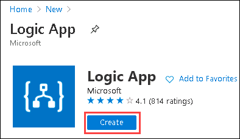
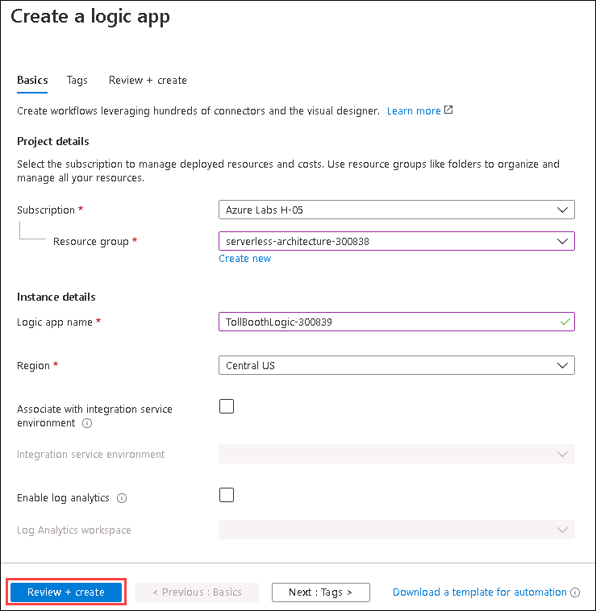

## Exercise 6: Create the data export workflow

**Duration**: 30 minutes

In this exercise, you create a new Logic App for your data export workflow. This Logic App will execute periodically and call your ExportLicensePlates function, then conditionally send an email if there were no records to export.

### Task 1: Create the Logic App

1. Navigate to the Azure portal, <http://portal.azure.com>.

2. Select **+ Create a resource**, then enter **logic app** into the search box on top. Select **Logic App** from the results.

    

3. Select the **Create** button on the Logic App overview blade.

    

4. On the **Create Logic App** blade, specify the following configuration options:

    a. For Name, type a unique value for the App name similar to **TollBoothLogic-DID** (ensure the green check mark appears).

    b. Specify the Resource Group **serverless-architecture-DID**.

    c. Select the **Region** option for the location, then select the same **Location** as your Resource Group region.

    d. Leave**Enable Log Analytics** option as **Unchecked**.

    

5. Select **Review + create**, then select **Create**. Open the Logic App once it has been provisioned.

6. In the Logic App Designer, scroll through the page until you locate the _Start with a common trigger_ section. Select the **Recurrence** trigger.

    

7. Enter **15** into the **Interval** box, and make sure Frequency is set to **Minute**. This can be set to an hour or some other interval, depending on business requirements.

8. Select **+ New step**.

    

9. Enter **Functions** in the filter box, then select the **Azure Functions** connector.

    

10. Select your Function App whose name ends in **FunctionApp**, or contains the ExportLicensePlates function.

    

11. Select the **ExportLicensePlates** function from the list.

    

12. This function does not require any parameters that need to be sent when it gets called. Select **+ New step**, then search for **condition**. Select the **Condition** Control option from the Actions search result.

    

13. For the **value** field, select the **Status code** parameter. Make sure the operator is set to **is equal to**, then enter **200** in the second value field.

    > **Note**: This evaluates the status code returned from the ExportLicensePlates function, which will return a 200 code when license plates are found and exported. Otherwise, it sends a 204 (NoContent) status code when no license plates were discovered that need to be exported. We will conditionally send an email if any response other than 200 is returned.

    

14. We will ignore the If true condition because we don't want to perform an action if the license plates are successfully exported. Select **Add an action** within the **If false** condition block.

    

15. Enter **Send an email** in the filter box, then select the **Send an email (V2)** action for Office 365 Outlook.

    

16. Select **Sign in** and sign into your Office 365 Outlook account.
    * Following are the Username and password for office 365, this is same which you are using to login to Azure portal. You can get it from **Lab Environment Details** tab also.
       * Username: <inject key="AzureAdUserEmail"></inject>
       * Password: <inject key="AzureAdUserPassword"></inject>

    

17. In the Send an email form, provide the following values:

    a. Enter your email address in the **To** box.

    b. Provide a **Subject**, such as **Toll Booth license plate export failed**.

    c. Enter a message into the **Body**, and select the **Status code** from the ExportLicensePlates function so that it is added to the email body.

    

18. Select **Save** in the tool bar to save your Logic App.

19. Select **Run** to execute the Logic App. You should start receiving email alerts because the license plate data is not being exported. This is because we need to finish making changes to the ExportLicensePlates function so that it can extract the license plate data from Azure Cosmos DB, generate the CSV file, and upload it to Blob storage.

    

20. While in the Logic Apps Designer, you will see the run result of each step of your workflow. A green checkmark is placed next to each step that successfully executed, showing the execution time to complete. This can be used to see how each step is working, and you can select the executed step and see the raw output.

    

21. The Logic App will continue to run in the background, executing every 15 minutes (or whichever interval you set) until you disable it. To disable the app, go to the **Overview** blade for the Logic App and select the **Disable** button on the taskbar.

