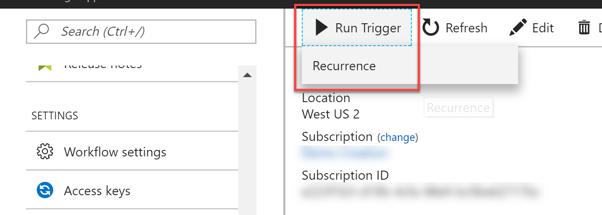

## Exercise 8: Rerun the workflow and verify data export

**Duration**: 10 minutes

With the latest code changes in place, run your Logic App and verify that the files are successfully exported.

### Task 1: Run the Logic App

1. Open your serverless-architecture-DID resource group in the Azure portal, then select your Logic App.

2. From the **Overview** blade, select **Enable**.

3. Now select **Run Trigger**, then select **Recurrence** to immediately execute your workflow.

4. Select the **Refresh** button next to the Run Trigger button to refresh your run history. Select the latest run history item. If the expression result for the condition is **true**, then that means the CSV file should've been exported to Blob storage. Be sure to disable the Logic App so it doesn't keep sending you emails every 15 minutes. Please note that it may take longer than expected to start running, in some cases.

    

### Task 2: View the exported CSV file

1. Open your ServerlessArchitecture resource group in the Azure portal, then select your **Storage account** you had provisioned to store uploaded photos and exported CSV files.

2. In the Overview pane of your storage account, select **Containers**.

    

3. Select the **export** container.

    

4. You should see at least one recently uploaded CSV file. Select the filename to view its properties.

    

5. Select **Download** in the blob properties window.

    

    The CSV file should look similar to the following:

    

6. The ExportLicensePlates function updates all of the records it exported by setting the exported value to true. This makes sure that only new records since the last export are included in the next one. Verify this by re-executing the script in Azure Cosmos DB that counts the number of documents in the Processed collection where exported is false. It should return 0 unless you've subsequently uploaded new photos.
